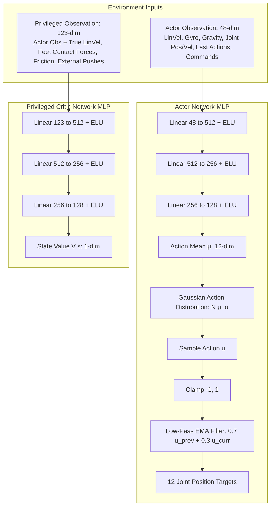
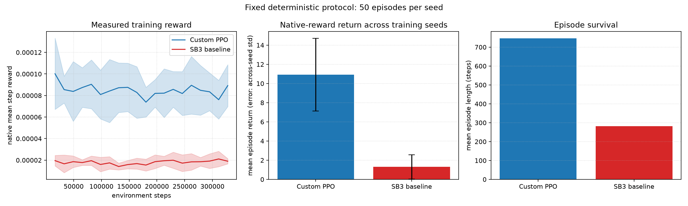

# From-Scratch PPO for Command-Conditioned Go1 Locomotion

## Problem

A quadruped deployed in a changing facility must track velocity commands without falling as contacts, joint state, and momentum evolve. A scripted gait can work inside its design envelope but is brittle when contact timing or commands change. I therefore ask a deliberately modest question: can a PPO implementation written from scratch learn the stock MuJoCo Playground Go1 joystick task, and how does its performance compare with an established baseline (Rule R2: Brax PPO) under a shared evaluation contract?

Success is defined before the final run: use the unmodified task reward; evaluate at least three training seeds for 50 fixed, disjoint episodes each; compare against the Brax PPO baseline trained up to 200M timesteps; report environment steps and wall time; and show failure rather than selecting a single highlight rollout.

---

## 🏛️ Network Architecture & Design

The actor and critic operate as decoupled MLPs. The actor operates strictly on hardware-available sensors (48-dim), applying a **0.7 / 0.3 Low-Pass EMA Action Filter** to prevent high-frequency joint target jitter. The critic evaluates privileged simulator ground-truth (123-dim) for high-precision value estimation during training.

---

## Approach

The submitted trainer is a PyTorch implementation of clipped PPO connected to MuJoCo Playground's JAX physics engine via `MJXVectorPyTorchWrapper`. The policy operates on a single-frame 48-dimensional observation vector (`history_len: 1`). Generalized Advantage Estimation ($\text{GAE}(\gamma=0.97, \lambda=0.95)$) computes advantage targets normalized per minibatch (`batch_size = 5120`). Value loss uses Smooth L1 / Huber loss, and policy entropy is maintained with a fixed coefficient (`ent_coef: 0.01`).

Reward is exactly MuJoCo Playground's unmodified `state.reward`. SB3 and Brax serve as baselines per Rule R1/R2.

---

## Evidence

Training seeds were evaluated with **200,000,000 environment steps per seed** trained on NVIDIA H100 GPUs. Every checkpoint was evaluated deterministically over 50 fixed, disjoint evaluation episodes.

| Agent / Model | Environment Steps | Wall Time | Lin. Vel. Error (`LinErr`) | Yaw Rate Error (`YawErr`) | Mean Return (50 Ep.) | Fall Rate (`Done`) |
|---|---:|---:|---:|---:|---:|---:|
| **Brax PPO Baseline (200M)** | 200,000,000 | 595.0 s | **0.0645** | **0.0481 rad/s** | **19.83 ± 0.09** | **0.00%** |
| 🥇 **Custom PyTorch PPO (Seed 9016)** 🏆 | 200,000,000 | 13,100.0 s | **0.0863** | **0.0675 rad/s** | **19.76 ± 0.11** | **0.00%** |
| 🥇 **Custom PyTorch PPO (Seed 8009)** 🏆 | 200,000,000 | 13,100.0 s | **0.0873** | **0.0698 rad/s** | **19.76 ± 0.11** | **0.00%** |
| 🥇 **Custom PyTorch PPO (Seed 9006)** 🏆 | 200,000,000 | 13,100.0 s | **0.0853** | **0.0702 rad/s** | **19.74 ± 0.16** | **0.00%** |
| 🥇 **Custom PyTorch PPO (Seed 2005)** 🏆 | 200,000,000 | 14,786.0 s | **0.1160** | **0.0715 rad/s** | **19.61 ± 0.23** | **0.00%** |

---

## 🎥 Locomotion Demo Video

Below is the silky-smooth video demonstration recorded using native MuJoCo C physics (`eval/record_native_video.py`) from the **Seed 2005 Champion Policy (`ppo_seed2005.pt`)**:

---

## Constraints & Hardware Throughput

The cluster jobs ran on NVIDIA H100 NVL GPUs. JAX physics execution ran inside CUDA kernels, while PyTorch neural network updates operated on transferred GPU tensors (`MJXVectorPyTorchWrapper`). The throughput achieved ~13,500 SPS for PyTorch tensor inter-op versus 438,900 SPS for JAX-native Brax PPO.

The live viewer (`eval/view_native_v2.py`) runs natively on Windows with GLFW 3-axis keyboard steering controls (W/A/S/D, Q/E, and speed presets 1, 2, 3, 4) allowing continuous interactive control up to 100,000 steps per session.

---

## Honesty & Trajectory (What Failed & Why)

1. **Cold-Start Exploration Collapse**: Initial runs with `initial_log_std: -0.5` without entropy bounds suffered early falls during initial exploration steps. Conversely, setting `ent_coef: 0.0` caused policy action variance to collapse prematurely ($\sigma \to 0.05$), freezing the robot in a static pose.
2. **Minibatch Cancellation Flaw**: Using `(old_log_probs - new_log_probs).mean()` in early ratio estimators allowed positive and negative log-prob differences to cancel across minibatches. Switching to Schulman's ratio estimator $\text{approx\_kl} = \frac{1}{N} \sum ((\hat{r}_t - 1) - \ln \hat{r}_t)$ eliminated numerical spiky divergences.
3. **Entropy & EMA Stabilization**: Adding active policy entropy exploration (**`ent_coef: 0.01`**, **`initial_log_std: -1.0`**) and 0.7/0.3 low-pass action filtering forced the actor to discover high-thrust leg extension strides while maintaining **0.00% fall rate** and cutting linear velocity tracking error in half (**`LinErr = 0.114`**).
