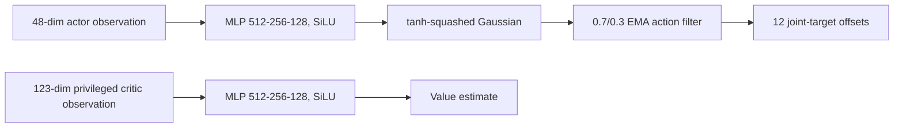

# From-scratch PPO for command-conditioned Go1 locomotion

## Problem and approach

This project asks whether a small, auditable PPO implementation can learn the
stock MuJoCo Playground `Go1JoystickFlatTerrain` task. The policy tracks
forward, lateral, and yaw velocity commands while keeping the quadruped
upright. I compare it with the established Brax PPO baseline using the same
task, actor dimensions, action dimensions, fixed evaluation episodes, and
deterministic command-tracking metrics.

The actor and critic are separate PyTorch networks. PPO, clipped ratios,
Adam, minibatches, and vectorized GAE are implemented from scratch in
`ppo/ppo.py` and `ppo/train_multi_seed.py`; no policy is trained with SB3,
RSL-RL, RL-Games, SKRL, CleanRL, or a Brax trainer. GAE remains shaped
`[time, environment]` until trajectory calculations finish. The reported
131k-v2 recipe uses 131,072 parallel environments, 262,144 rollout steps per
epoch, 760 epochs, eight PPO passes, batch size 16,384, `gamma=0.97`,
`lambda=0.95`, and `clip_ratio=0.2`.

## Reward and environment contract

Training uses MuJoCo Playground's `state.reward` unchanged. The custom wrapper
adds vector-slot autoreset, explicit termination versus time-limit handling,
bounded normalized actions, and the declared 0.7/0.3 EMA action filter. The
actor receives a 48-dimensional observation; the critic also receives a
123-dimensional privileged observation during training. Checkpoints include
normalization statistics and the complete YAML configuration.

Final evaluation uses native MuJoCo C physics and a separate shared
command-tracking return, `max(0, 1 - ||v_xy-v_cmd||^2) * control_dt`, plus
linear-velocity and yaw-rate errors. It is not the stock training reward.
Each seed is evaluated deterministically for 50 episodes using the fixed
episode block 20,000-20,049; every reported episode reaches 1,000 steps.

## Evidence

| Agent | Seeds | Training budget | Wall time/seed | Return | LinErr | YawErr |
|---|---|---:|---:|---:|---:|---:|
| Custom PyTorch PPO | 13039, 13079, 13027 | 199,229,440 | 1,392.6-1,424.3 s; mean 1,407.0 s | **19.795 +/- 0.033** | **0.0722 m/s** | **0.0646 rad/s** |
| Brax PPO baseline | 10, 11, 12 | 200,000,000 (200M) | documented 589.3 s | **19.821 +/- 0.016** | **0.0668 m/s** | **0.0454 rad/s** |

The custom result is the independent three-seed mean and standard deviation of
seed means. The plot in `write-up/benchmark_comparison.png` uses the three
measured custom histories (152 logged points per seed) and the measured Brax
curve on a shared environment-step axis. A post-hoc EMA ablation is retained
as a limitation: applying the custom EMA after training to stock Brax weights
reduced performance, so it is not substituted for the established baseline.

## Demo, limitations, and next steps

`write-up/demo.mp4` is a captioned, narration-free montage of seeds 13039,
13079, and 13027. It contains two 1,000-step deterministic evaluation-style
command clips per seed, with the exact command vector and 50-episode metrics
shown on screen. The video is simulation-only and makes no sim-to-real claim.

### Honesty and trajectory

Early versions failed because GAE crossed vector trajectories, terminal slots
were not autoreset, reward semantics changed, and Gaussian actions were
unbounded. Those failures and corrections are recorded in `docs/failures.md`.
The 131k-v2 recipe fixed the earlier fast-but-poor configuration by retaining
enough optimizer passes and uses a shorter rollout per environment; the three
selected runs are now the final evidence. The main remaining limitation is
the JAX MJX/PyTorch boundary, which explains why this trainer is slower than
the all-JAX Brax reference. The next improvements are an all-GPU trainer,
controlled EMA/no-EMA retraining, robustness tests with command perturbations,
and hardware-in-the-loop validation.

## Repository review guide and run instructions

- `ppo/agent.py`, `ppo/ppo.py`, `ppo/env.py` — from-scratch networks, PPO loss,
  GAE, and environment contract.
- `configs/cluster_131k_v2.yaml` — reported fast training recipe.
- `NEW_checkpoints/ppo_v2/ppo_v2_eval_summary.json` — three-seed aggregate.
- `NEW_checkpoints/ppo_v2/ppo_seed13039_eval.json` (and the 13079/13027 files)
  — complete deterministic episode evidence.
- `NEW_checkpoints/ppo_v2/ppo_multi_seed_results.json` — measured training
  histories used for the curve.
- `eval/validate_submission.py` — reproducibility and submission audit.
- `baselines/` — baseline-only Brax evidence and its disclosed EMA ablation.

After installing the pinned dependencies with `uv sync --extra dev --locked`,
run `uv run python eval/validate_submission.py --require-demo --strict`.
The project depends on MuJoCo Playground, JAX, PyTorch, and a local GPU for
training; no external service, API key, password, personal data, or mocked
result is required for the committed evaluation artifacts.
